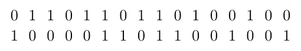
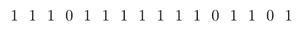
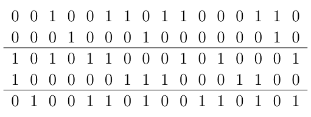
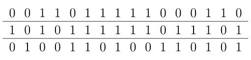
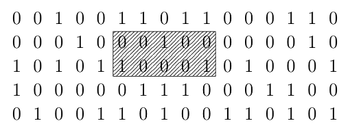
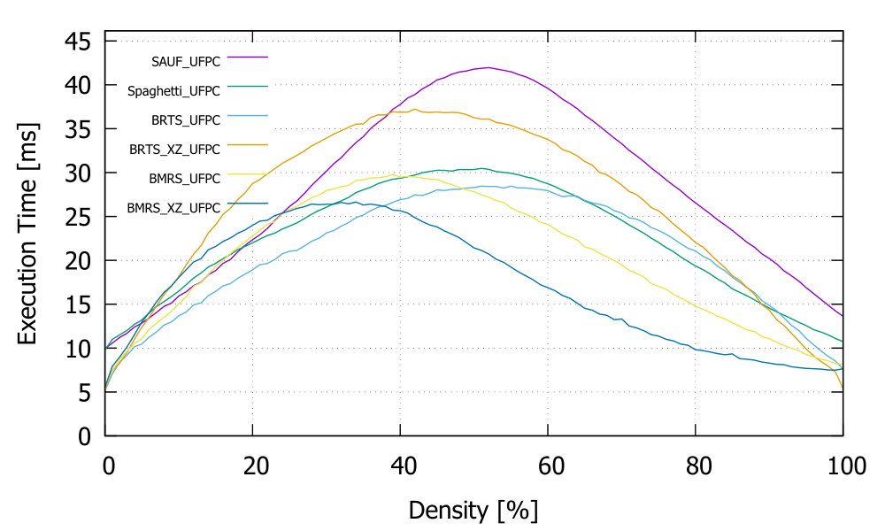

# Bit-Merge-Run Scan

Bit-Run Two-Scan (BRTS) runs faster when the input data are simple (consist of big chunks sharing labels), but inefficient when it's complex. Bit-Merge-Run Scan (BMRS) only supports 8-connectivity mode, but solves this problem greatly. 

BMRS shares many parts of its algorithm with BRTS. If you have not read [Labeling_BRTS.md](Labeling_BRTS.md), please read the document first. Parts which has already dealt in that document will not be re-explained here. 


##  Basic idea

1-bit per pixel format makes many collective operations on pixels can be done very effectively. Some of them turn out to be useful to find connected parts. See two-row data described below as an example.

 

What is the most effective CCL algorithm for this kind of data? If the data are in 1-bit per pixel format, the answer is simple. One can simply find the answer using bitwise OR operation on the upper layer and the lower layer as operands. It gives

 

which clearly has four connected chunks. They turn out to be equivalent to four connected components exist in the original data. The whole idea of BMRS is based on this property. It merges two lines and apply the bit-scanning algorithm on those merged bits. If the data has 5 rows, they can be grouped like this.

 

BMRS first merges every two rows in a group using the bitwise OR operator. This gives new data as below.

 

Unfortunately, many connected parts of this data are actually disconnected. It looks like the 5-10 bits of the first line and the second line are definitely connected in the picture above. This marked area of the original data shows that they aren't. 

 

Note that if *any* of the bits in the first layer of this marked area is connected to *any* of the second layer, they would be all connected, for it's already guaranteed that every bits of the upper layer and lower layer are connected respectively. Checking if there is a part connected between the two is actually easy. Let us call the upper one `u` and the lower one `d`. There should be at least one connected part if and only if the result of this operation is nonzero.

```
(u | (u << 1)) & (d | (d << 1))
```

One doesn't have to calculate this whenever it needs. One can just pre-calculate this for every junction point and use them. See following codes.

```
//generate flag bits
Data_Compressed dt_flags(h_merge - 1, width);
for (u32 i = 0; i < dt_flags.height; i++) {
	u32* bits_u = data_compressed.bits + data_width * (2 * i + 1);
	u32* bits_d = data_compressed.bits + data_width * (2 * i + 2);
	u32* bits_dest = dt_flags.bits + dt_flags.data_width * i;

	u32 u0 = bits_u[0];
	u32 d0 = bits_d[0];
	bits_dest[0] = (u0 | (u0 << 1)) & (d0 | (d0 << 1));
	for (u32 j = 1; j < data_width; j++) {
		u32 u = bits_u[j];
		u32 u_shl = u << 1;
		u32 d = bits_d[j];
		u32 d_shl = d << 1;
		if (bits_u[j - 1] & 0x80000000) u_shl |= 1;
		if (bits_d[j - 1] & 0x80000000) d_shl |= 1;
		bits_dest[j] = (u | u_shl) & (d | d_shl);
	}
}
```

After this flag bits are made, checking if a seemingly connected part of the merged data is really connected or not becomes very easy task. Here is the full inline function I use for that. `flag_bits` points the junction flag datas between two lines. 

```
inline unsigned __int64 CCL_BMRS_X64_is_connected(const unsigned __int64* flag_bits, unsigned start, unsigned end) {
	if (start == end) return flag_bits[start >> 6] & ((unsigned __int64)1 << (start & 0x0000003F));

	unsigned st_base = start >> 6;
	unsigned st_bits = start & 0x0000003F;
	unsigned ed_base = (end + 1) >> 6;
	unsigned ed_bits = (end + 1) & 0x0000003F;
	if (st_base == ed_base) {
		unsigned __int64 cutter = (0xFFFFFFFFFFFFFFFF << st_bits) ^ (0xFFFFFFFFFFFFFFFF << ed_bits);
		return flag_bits[st_base] & cutter;
	}

	for (unsigned i = st_base + 1; i < ed_base; i++) {
		if (flag_bits[i]) return true;
	}
	unsigned __int64 cutter_st = 0xFFFFFFFFFFFFFFFF << st_bits;
	unsigned __int64 cutter_ed = ~(0xFFFFFFFFFFFFFFFF << ed_bits);
	if (flag_bits[st_base] & cutter_st) return true;
	if (flag_bits[ed_base] & cutter_ed) return true;
	return false;
}
```

The later part involving `for` statement rarely executes since most of the runs are small. If not, *any* bundle of performing that `for` statement would certainly overwhelmed by the benefits of the algorithm which can check big chunks at once. The check only ends after one or two `if` statements with 4~12 bit operations. 

To sum up, the bit-merging enables one to analyze only half amount of scan-lines to process same image with smallest costs as possible. It also eliminates a lot of noises in the original data so that the run-based algorithms can work faster. The whole idea of BMRS is based on this. 


## New second step: label generating

The first step of BMRS which is to find runs in scan-lines is same with the first step of BRTS. The only difference is that it does the same thing on merged bits, not the original 1-bit per pixel input data. 

The second step to generate labels, however, should be different. The new code to generates labels on runs is as follows. This uses the function `CCL_BMRS_X64_is_connected` I previously have shown.

```
Run* runs_up = runs;

//generate labels for the first row
for (; runs->start_pos != 0xFFFF; runs++) runs->label = labelsolver.NewLabel();
runs++;

//generate labels for the rests
for (; runs != runs_end; runs++) {
	Run* runs_save = runs;
	for (;; runs++) {
		unsigned short start_pos = runs->start_pos;
		if (start_pos == 0xFFFF) break;

		//Skip upper runs end before this run starts 
		for (; runs_up->end_pos < start_pos; runs_up++);

		//No upper run meets this
		unsigned short end_pos = runs->end_pos;
		if (runs_up->start_pos > end_pos) {
			runs->label = labelsolver.NewLabel();
			continue;
		};

		//Next upper run can not meet this
		unsigned short cross_st = (start_pos >= runs_up->start_pos) ? start_pos : runs_up->start_pos;
		if (end_pos <= runs_up->end_pos) {
			if (CCL_BMRS_X64_is_connected(flags, cross_st, end_pos)) runs->label = labelsolver.GetLabel(runs_up->label);
			else runs->label = labelsolver.NewLabel();
			continue;
		}

		unsigned label;
		if (CCL_BMRS_X64_is_connected(flags, cross_st, runs_up->end_pos)) label = labelsolver.GetLabel(runs_up->label);
		else label = 0;
		runs_up++;

		//Find next upper runs meet this
		for (; runs_up->start_pos <= end_pos; runs_up++) {
			if (end_pos <= runs_up->end_pos) {
				if (CCL_BMRS_X64_is_connected(flags, runs_up->start_pos, end_pos)) {
					unsigned label_other = labelsolver.GetLabel(runs_up->label);
					if (label != label_other) {
						label = (label) ? labelsolver.Merge(label, label_other) : label_other;
					}
				}
				break;
			}
			else {
				if (CCL_BMRS_X64_is_connected(flags, runs_up->start_pos, runs_up->end_pos)) {
					unsigned label_other = labelsolver.GetLabel(runs_up->label);
					if (label != label_other) {
						label = (label) ? labelsolver.Merge(label, label_other) : label_other;
					}
				}
			}
		}

		if (label) runs->label = label;
		else runs->label = labelsolver.NewLabel();
	}
	runs_up = runs_save;
	flags += flag_width;
}
```


## New final step

In BMRS, each runs represents a connected part of merged two scanline. To transform this information into 2D label map, it writes two scanlines at once. The variables `labels_u`, `labels_d` represents the two scanline in the following code. 

```
Run* runs = Data_run.runs;
for (size_t i = 0; i < height / 2; i++) {
	const char* data_u = (const char*)source + (size_t)row_bytes * 2 * i;
	const char* data_d = data_u + row_bytes;
	unsigned* labels_u = dest + (size_t)width * 2 * i;
	unsigned* labels_d = labels_u + width;

	for (size_t j = 0;; runs++) {
		unsigned short start_pos = runs->start_pos;
		if (start_pos == 0xFFFF) {
			for (size_t k = j; k < width; k++) labels_u[k] = 0;
			for (size_t k = j; k < width; k++) labels_d[k] = 0;
			runs++;
			break;
		}
		unsigned short end_pos = runs->end_pos;
		unsigned label = labelsolver.GetLabel(runs->label);

		for (; j < start_pos; j++) labels_u[j] = 0, labels_d[j] = 0;
		for (; j < end_pos; j++) {
			labels_u[j] = (data_u[j >> 3] & (1 << (j & 0x07))) ? label : 0;
			labels_d[j] = (data_d[j >> 3] & (1 << (j & 0x07))) ? label : 0;
		}
	}
}
if (height % 2) {
	unsigned* labels = dest + width * (height - (size_t)1);
	for (size_t j = 0;; runs++) {
		unsigned short start_pos = runs->start_pos;
		if (start_pos == 0xFFFF) {
			for (size_t k = j; k < width; k++) labels[k] = 0;
			break;
		}
		unsigned short end_pos = runs->end_pos;
		unsigned label = labelsolver.GetLabel(runs->label);
		for (; j < start_pos; j++) labels[j] = 0;
			for (j = start_pos; j < end_pos; j++) labels[j] = label;
	}
}
```

This final step of BMRS is more inefficient then of BRTS. It makes BMRS a bit slower than BRTS when the input data is simple. Instead, BMRS runs faster when input image or data is complex. For most random images with 50% foreground density, BMRS beats every known CCL algorithms even when the original image is not in 1-bit per pixel format so it have to change the format first. 

<table>
  <tr>
    <td align="center"></td>
    <td align="center"></td>
  </tr>
  <tr>
    <td align="center">AMD Ryzen 3 2200G with Radeon Vega Graphics</td>
    <td align="center">Intel(R) Pentium(R) Gold G5420</td>
  </tr>
</table>

