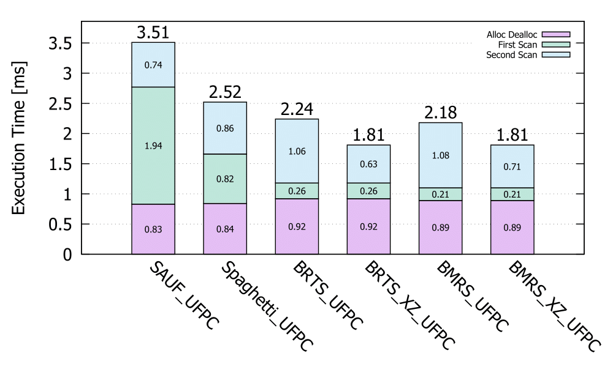
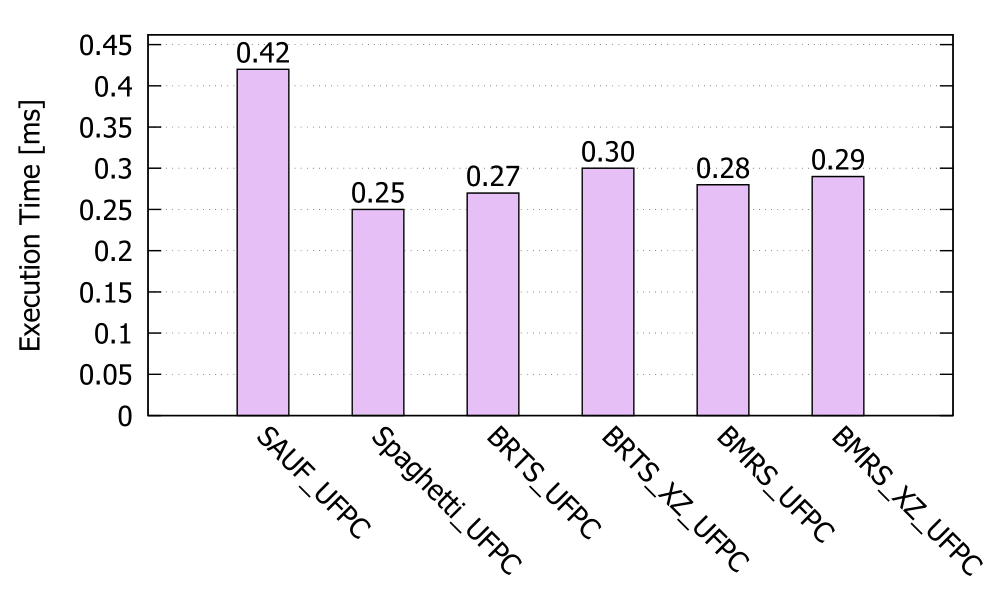
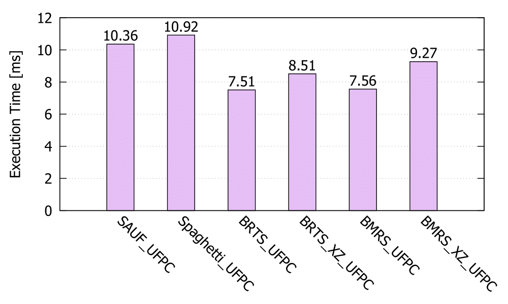
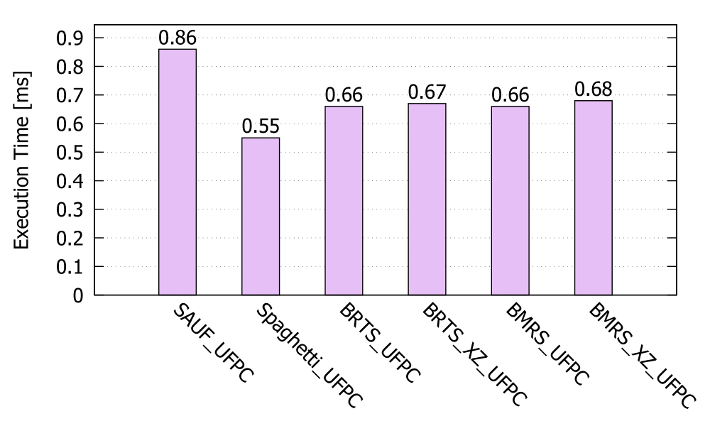
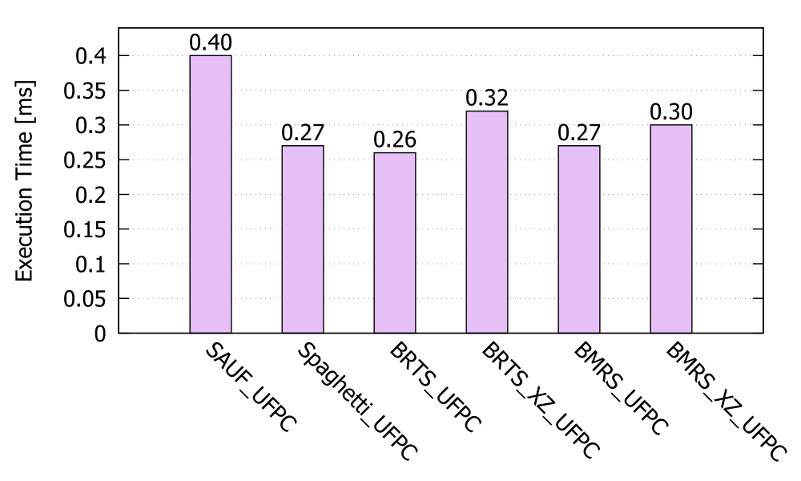
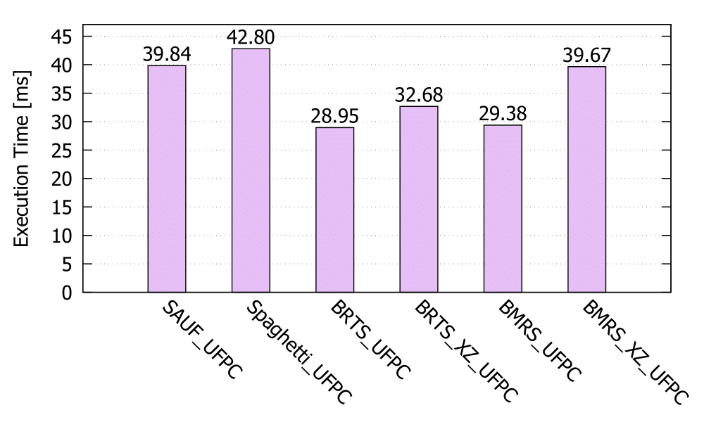

# Ultra Fast Bit Labeller

Connected-component labeling (CCL) , which distinguish objects in an image by assigning a unique label for each connected component, has various uses besides image processing. For example, finding if certain part of a map is connected to other may play important role in some game AI. Using CCL algorithm can be the best choice if the check has to be made globally.  

Unfortunately, all of known algorithms for CCL require at least 1-byte per pixel data as input. There is no CCL algorithm available which can be directly applied to 1-bit per pixel format, which is most natural for binary image or data.

Using 1-bit per pixel format on binary data not only saves memory, but also allows processing for multiple pixels at once. It can be the best choice depending on the purpose. Ultra Fast Bit Labeller(UFBL) provides CCL algorithms specialized for the format. Scientific research <a href="#BRTS">[1]</a> shows that UFBL algorithms on 1-bit per pixel format are much faster than all other CCL algorithms known at 2021 on their own preferred format. 


## How to use

UFBL contains two algorithms named Bit-Run Two Scan (BRTS) and Bit-Merge-Run Scan (BMRS). Each algorithms requires one source file, one header file, and common headers named *Formats.h*, *label_solver.h*. The last one contains code for a data structure named Union-Find with path compression (UFPC) label solver which is developed by Kesheng Wu, Ekow Otoo and Kenji Suzuki. Algorithms for x86, x64 processor also require *Format_changer_X86.h*, *Format_changer_X64.h* respectively. 

BRTS supports both 4-connectivity and 8-connectivity, while BMRS only supports 8-connectivity. Since each algorithms has two versions which work on x86 processor and x64 processor, total 6 version of UFBL algorithm are available. 

<table>
  <tr>
    <th>Algorithm name</th>
    <th>Mode</th>
    <th>Architecture</th>
    <th>Required Files</th>
  </tr>	
  <tr>
    <td align="center">Bit Run Two Scan</td>
    <td align="center">4-connectivity</td>
    <td align="center">x86</td>
    <td align="center"><i>Labeling_BRTS_4c_x86.h</i>, <i>Labeling_BRTS_4c_x86.cpp</i></td>
  </tr>
  <tr>
    <td align="center">〃</td>
    <td align="center">〃</td>
    <td align="center">x64</td>
    <td align="center"><i>Labeling_BRTS_4c_x64.h</i>, <i>Labeling_BRTS_4c_x64.cpp</i></td>
  </tr>
  <tr>
    <td align="center">〃</td>
    <td align="center">8-connectivity</td>
    <td align="center">x86</td>
    <td align="center"><i>Labeling_BRTS_8c_x86.h</i>, <i>Labeling_BRTS_8c_x86.cpp</i></td>
  </tr>
  <tr>
    <td align="center">〃</td>
    <td align="center">〃</td>
    <td align="center">x64</td>
    <td align="center"><i>Labeling_BRTS_8c_x64.h</i>, <i>Labeling_BRTS_8c_x64.cpp</i></td>
  </tr>
  <tr>
    <td align="center">Bit Merge Run Scan</td>
    <td align="center">〃</td>
    <td align="center">x86</td>
    <td align="center"><i>Labeling_BMRS_8c_x86.h</i>, <i>Labeling_BMRS_8c_x86.cpp</i></td>
  </tr>
  <tr>
    <td align="center">〃</td>
    <td align="center">〃</td>
    <td align="center">x64</td>
    <td align="center"><i>Labeling_BMRS_8c_x64.h</i>, <i>Labeling_BMRS_8c_x64.cpp</i></td>
  </tr>
</table>
To use BMRS algorithm in your 64-bit program, for example, you only have to include *Labeling_BMRS_8c_x64.h*, *Labeling_BMRS_8c_x64.cpp*, *Formats.h*, *Format_changer_X64.h* and *label_solver.h*  in your project. The converting function is declared in *Labeling_BMRS_8c_x64.h*. 

```C++
void Labeling_BMRS_X64(unsigned* dest, const void* source, int height, int width
                       , int data_width = 0, int fmbits = BTCPR_FM_ALIGN_8 | BTCPR_FM_PADDING_ZERO);
```

`dest` must be a pointer to an array buffer of size of the numer of pixels in which the labels will be generated. `source` must be a pointer to the input data which saves 2D binary image in 1-bit per pixel format. The fifth parameter `data_width` represents byte distance between starting address of `n`-th row and of `n+1`-th row. If this argument is zero, the distance will be assumed according to the width of the image and the alignment option passed as the last argument.

The last argument is a combination of flag bits which are to specify the format of the input data. The flags used with this parameter are defined in *Formats.h*. See following table for the names, meaning, and values of the flags.

| Name                   | Meaning                                                      | Value      |
| ---------------------- | ------------------------------------------------------------ | ---------- |
| BTCPR_FM_ALIGN_1       | Rows are aligned at byte boundary. Padding bits are inserted if the width of the image is not a multiple of 8. Ignored if `data_width` is nonzero. | 0x00000001 |
| BTCPR_FM_ALIGN_2       | Rows are aligned at word boundary. Padding bits are inserted if the width of the image is not a multiple of 16. Ignored if `data_width` is nonzero. | 0x00000002 |
| BTCPR_FM_ALIGN_4       | Rows are aligned at double word boundary. Padding bits are inserted if the width of the image is not a multiple of 32. Ignored if `data_width` is nonzero. | 0x00000004 |
| BTCPR_FM_ALIGN_8       | Rows are aligned at quadruple word boundary. Padding bits are inserted if the width of the image is not a multiple of 64. Ignored if `data_width` is nonzero. | 0x00000008 |
| BTCPR_FM_NO_ALIGN      | There is no padding bit between rows. Ignored if `data_width` is nonzero. | 0x00000000 |
| BTCPR_FM_B1W0          | Bit 1 is black and 0 is white. Default is the other way round. This flag can also be used to perform CCL on black area of image, instead of usual white one. (If the source image does not use 0 as black. If it does, one can perform CCL on black area by *not* setting this flag.) | 0x80000000 |
| BTCPR_FM_MSB_FIRST     | Bits in a byte are saved in most-significant-bit to least-significant-bit order so that it is consistent with the binary number notation. Default is the other way round. | 0x40000000 |
| BTCPR_FM_PADDING_MSB   | Padding bits are at the most-significant area of the last byte. If the last bits are 1,0,0,1, the last byte will be 0b1001, instead of 0b10010000. Ignored if `BTCPR_FM_MSB_FIRST` is not setted. | 0x20000000 |
| BTCPR_FM_PADDING_ZERO  | Padding bits are filled with zero. If this flag is not setted, the padding bits can be filled with garbage bits. Ignored if the source data does not have padding bits. | 0x10000000 |
| BTCPR_FM_ZERO_BUF\*    | Output memory is already zero-initialized. UFBL algorithms can run faster is this is known for it can then skip the step. | 0x08000000 |
| BTCPR_FM_NO_ZEROINIT\* | Recommended if input image has fine granularity and high (more than 40%) foreground pixel density. Without this flag, the output buffer will be zero-initialized collectively before the second scan so that background pixels can be skipped when write labels to the buffer. With this flag, background pixels in the output buffer will be set to zero during the second scan. | 0x04000000 |

\*The last two options are not about input image format, but about initial state of the output buffer or specific stratege on writing labels to the buffer. 


If user can choose which format to use, format `BTCPR_FM_ALIGN_8 | BTCPR_FM_PADDING_ZERO` is recommanded for x64 algorithms and format `BTCPR_FM_ALIGN_4 | BTCPR_FM_PADDING_ZERO` is recommanded for x86 algorithms. If the input data does not have this format, UFBL creates new data which are equivalent to the original but uses different format and perform main algorithm on the new data. The format change algorithm is fast and effective. It takes less than 2% of the total excution time. 


## Benchmark

UFBL is a project which orients fast execution speed. One may want to know how fast each of the algorithms work. He can simply refer <a href="#BRTS">[1]</a> for this matter. (Unfortunately, the paper is incorrect on BRTS since the algorithm was not fully optimized yet.) Alternatively, he can use simple benchmark program provided here.

Files in [benchmark/](benchmark) folder do not need to run UFBL algorithm. It's just a simple sample program using UFBL library of which purpose is at the correctness, performance test of each CCL algorithms.

 

The benchmark program includes 5 different algorithm. The old [two-pass](https://en.wikipedia.org/wiki/Connected-component_labeling#Two-pass) algorithm, the [run-based two-scan](https://www.researchgate.net/publication/5462954_A_Run-Based_Two-Scan_Labeling_Algorithm) algorithm found by Lifeng He, Yuyan Chao and Kenji Suzuki (slightly improved by me), and UFBL algorithms. It also contains null algorithm which just copy input data for comparision. 

If there are no command line arguments, it makes a random 640 x 480 data, processes them using many CCL algorithms multiple times, and shows the execution time used for each. All algorithms except UFBL ones work on the original 4-byte per pixel format, while UFBL algorithms work on its compressed version which has 1-bit per pixel format.

If 24-bit bitmap or p4 pbm files are given as arguments, it does the same test on the input images. It also exports the result as another .bmp files. Each labels has distinguishable bright colors so one can easily check if the algorithm works correctly or not. 


## YACCLAB results

All of UFBL algorithms are also available at [YACCLAB](https://github.com/prittt/YACCLAB), so one can test the algorithms in their own system. Here is some results I got on my computers. 

The benchmark only uses images of 1-byte per pixel formats as inputs. Therefore, UFBL algorithms provided here contain additional step for 1 byte to 1 bit per pixel conversion. The *average* tests also consider the time for the conversion. On the other hand, when performing *average with steps* tests conversion time is ignored.

The following charts show some results for *average with steps* tests I got on AMD Ryzen 3 2200G processor using [YACCLAB](https://github.com/prittt/YACCLAB). The algoritims in comparison are SAUF (Scan Array-based with Union Find, also known as two-scan), Spaghetti (state of the art when <a href="#BRTS">[1]</a> is published), and UFBL algorithms. Suffix XZ here means that `BTCPR_FM_NO_ZEROINIT` flag is setted.

<table>
  <tr>
    <td align="center"></td>
    <td align="center"></td>
  </tr>
  <tr>
    <td align="center">MIRflickr</td>
    <td align="center">Hamlet</td>
  </tr>
  <tr>
    <td align="center"></td>
    <td align="center"></td>
  </tr>
  <tr>
    <td align="center">Tobacco800</td>
    <td align="center">3DPeS</td>
  </tr>
  <tr>
    <td align="center"></td>
    <td align="center"></td>
  </tr>
  <tr>
    <td align="center">Medical</td>
    <td align="center">Fingerprints</td>
  </tr>
  <tr>
    <td align="center"></td>
    <td align="center"></td>
  </tr>
  <tr>
    <td align="center">XDOCS</td>
    <td align="center"></td>
  </tr>
</table>
Interestingly enough, even in *average* tests disadvantageous to UFBL algorithms because of added conversion time, UFBL algorithms turn out to be faster than the state of art algorithm at early 2021 for some kind of inputs. This means that depending on the kind of inputs, using UFBL algorithms with format conversion can still be the most efficient way of CCL.

<table>
  <tr>
    <td align="center"></td>
    <td align="center"></td>
  </tr>
  <tr>
    <td align="center">MIRflickr</td>
    <td align="center">Hamlet</td>
  </tr>
  <tr>
    <td align="center"></td>
    <td align="center"></td>
  </tr>
  <tr>
    <td align="center">Tobacco800</td>
    <td align="center">3DPeS</td>
  </tr>
  <tr>
    <td align="center"></td>
    <td align="center"></td>
  </tr>
  <tr>
    <td align="center">Medical</td>
    <td align="center">Fingerprints</td>
  </tr>
  <tr>
    <td align="center"></td>
    <td align="center"></td>
  </tr>
  <tr>
    <td align="center">XDOCS</td>
    <td align="center"></td>
  </tr>
</table>
However, the results can be differ greatly according to on which processor or operating system the test is performed. For example, the test included in <a href="#BRTS">[1]</a> shows that Spagetti labeling is faster than both UFBL algorithms while the charts above show the opposite. See [YACCLAB/Results](YACCLAB/Results/) for more results I got on various computers.

[YACCLAB](https://github.com/prittt/YACCLAB) also provides benchmark for random images with various granularity and foreground pixel density. It shows in which cases one should choose each UFBL algorithms. Here is some results I got on AMD Ryzen 3 2200G with Radeon Vega Graphics. Time for the format conversion is included. 

<table>
  <tr>
    <td align="center"></td>
    <td align="center"></td>
  </tr>
  <tr>
    <td align="center">granularity 1 (fine)</td>
    <td align="center">granularity 2</td>
  </tr>
  <tr>
    <td align="center"></td>
    <td align="center"></td>
  </tr>
  <tr>
    <td align="center">granularity 4</td>
    <td align="center">granularity 8 (coarse)</td>
  </tr>
</table>


## UFBL algorithms

UFBL algorithms are based on the idea that CCL can be optimized using Find First Set hardware operations. See [Labeling_BRTS.md](Labeling_BRTS.md) and [Labeling_BMRS.md](Labeling_BMRS.md) for detailed explanations on how they work. Contributions of any kind are welcome. 


## References

<a name="BRTS">[1]</a> W. Lee, F. Bolelli, S. Allegretti, C. Grana. "Fast Run-Based Connected Components Labeling for Bitonal Images." 5th International Conference on Imaging, Vision & Pattern Recognition, 2021
