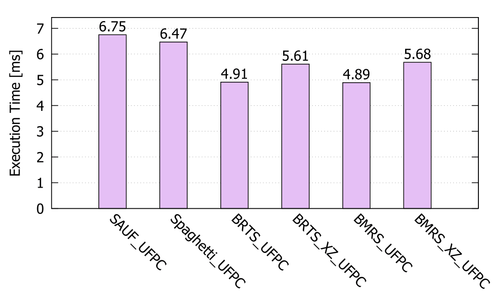
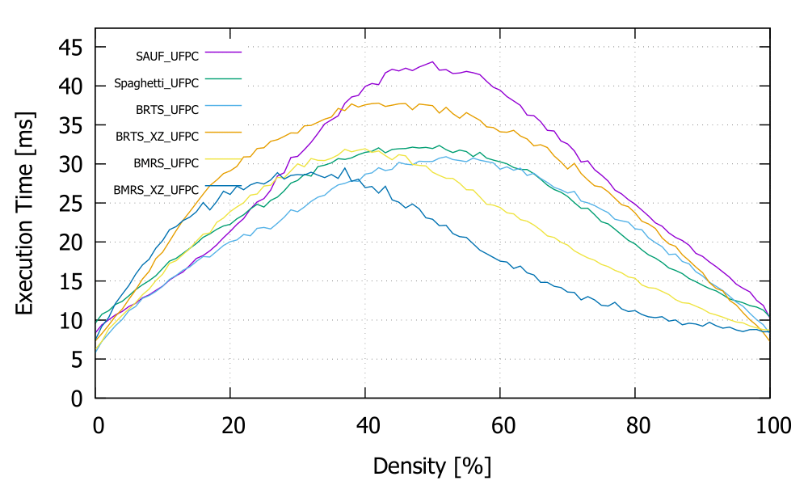
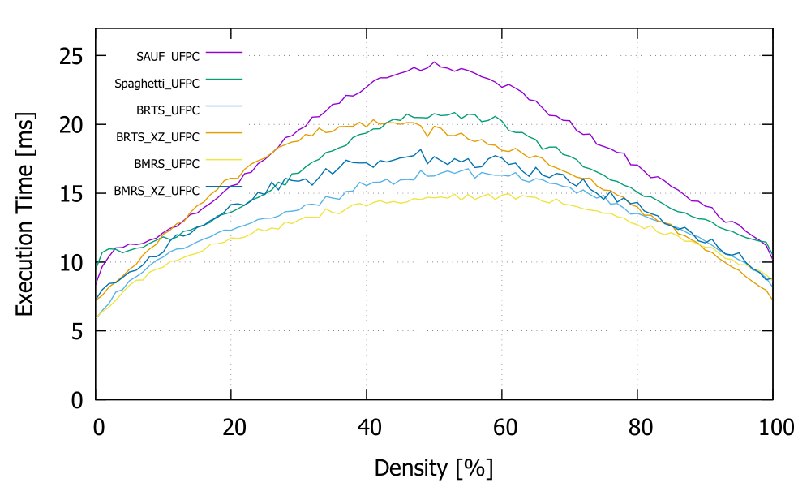
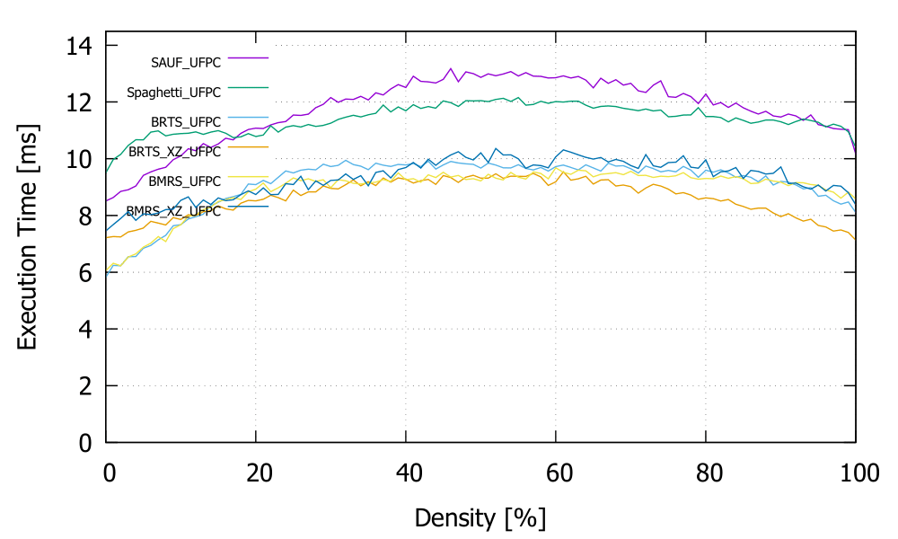

# Ultra Fast Bit Labeller

Connected-component labeling (CCL) , which distinguish objects in an image by assigning a unique label for each connected component, has various uses besides image processing. For example, finding if certain part of a map is connected to other may play important role in some game AI. Using CCL algorithm can be the best choice if the check has to be made globally.  

Unfortunately, all of known algorithms for CCL require at least 1-byte per pixel data as input. There is no CCL algorithm available which can be directly applied to 1-bit per pixel format, which is most natural for binary image or data.

Using 1-bit per pixel format on binary data not only saves memory, but also allows processing for multiple pixels at once. It can be the best choice depending on the purpose. Ultra Fast Bit Labeller(UFBL) provides CCL algorithms work very fast on the format. As we shell see, it turns out to be almost as fast as the best CCL algorithms known up to now, if not slightly faster.


## How to use

UFBL contains two algorithms named Bit-Run-Three-Scan (BRTS) and Bit-Merge-Run-Scan (BMRS). Each algorithms only requires one source file, one header file, and a common header named *label_solver.h*. The common header contains code for a data structure named Union-Find with path compression (UFPC) label solver which is developed by Kesheng Wu, Ekow Otoo and Kenji Suzuki.

BRTS supports both 4-connectivity and 8-connectivity, while BMRS only supports 8-connectivity. Since each algorithms has two versions which work on x86 processor and x64 processor, total 6 version of UFBL algorithm are available.

<table>
  <tr>
    <th>Algorithm name</th>
    <th>Mode</th>
    <th>Architecture</th>
    <th>Required Files</th>
  </tr>	
  <tr>
    <td align="center">Bit Run Three Scan</td>
    <td align="center">4-connectivity</td>
    <td align="center">x86</td>
    <td align="center"><i>Labeling_BRTS_4c_x86.h</i>, <i>Labeling_BRTS_4c_x86.cpp</i></td>
  </tr>
  <tr>
    <td align="center">〃</td>
    <td align="center">〃</td>
    <td align="center">x64</td>
    <td align="center"><i>Labeling_BRTS_4c_x64.h</i>, <i>Labeling_BRTS_4c_x64.cpp</i></td>
  </tr>
  <tr>
    <td align="center">〃</td>
    <td align="center">8-connectivity</td>
    <td align="center">x86</td>
    <td align="center"><i>Labeling_BRTS_8c_x86.h</i>, <i>Labeling_BRTS_8c_x86.cpp</i></td>
  </tr>
  <tr>
    <td align="center">〃</td>
    <td align="center">〃</td>
    <td align="center">x64</td>
    <td align="center"><i>Labeling_BRTS_8c_x64.h</i>, <i>Labeling_BRTS_8c_x64.cpp</i></td>
  </tr>
  <tr>
    <td align="center">Bit Merge Run Scan</td>
    <td align="center">〃</td>
    <td align="center">x86</td>
    <td align="center"><i>Labeling_BMRS_8c_x86.h</i>, <i>Labeling_BMRS_8c_x86.cpp</i></td>
  </tr>
  <tr>
    <td align="center">〃</td>
    <td align="center">〃</td>
    <td align="center">x64</td>
    <td align="center"><i>Labeling_BMRS_8c_x64.h</i>, <i>Labeling_BMRS_8c_x64.cpp</i></td>
  </tr>
</table>
To use BMRS algorithm in your 64-bit program, for example, you only have to include *Labeling_BMRS_8c_x64.h*, *Labeling_BMRS_8c_x64.cpp* and *label_solver.h*  in your project. The converting function is declared in *Labeling_BMRS_8c_x64.h*. 

```
void Labeling_BMRS_X64(unsigned* dest, const void* source, int height, int width, int alignment = 8);
```

`dest` must be a pointer to an array buffer of size of the numer of pixels in which the labels will be generated. `source` must be a pointer to the input data which saves 2D binary image in 1-bit per pixel format. Each rows can contain padding bits at the end to make every rows aligned in memory. The alignment must be same with `alignment` argument send to the function. Usually 4-byte alignment is recommended for x86 functions, and 8-byte alignment is recommended for x64 functions.


## Benchmark

UFBL is a project which orients fast execution speed. One may want to know how fast each of the algorithms work. Files in [benchmark/](benchmark) folder do not need to run UFBL algorithm. It allows one to test each UFBL algorithms in his system. 

 

The benchmark program includes 5 different algorithm. The old [two-pass](https://en.wikipedia.org/wiki/Connected-component_labeling#Two-pass) algorithm, the [run-based two-scan](https://www.researchgate.net/publication/5462954_A_Run-Based_Two-Scan_Labeling_Algorithm) algorithm found by Lifeng He, Yuyan Chao and Kenji Suzuki (slightly improved by me), and UFBL algorithms. It also contains null algorithm which just copy input data for comparision. 

If there are no command line arguments, it makes a random 640 x 480 data, processes them using many CCL algorithms multiple times, and shows the execution time used for each. All algorithms except UFBL ones work on the original 4-byte per pixel format, while UFBL algorithms work on its compressed version which has 1-bit per pixel format.

If 24-bit bitmap files are given as arguments, it does the same test on the input images. It also exports the result as another .bmp files. Each labels has distinguishable bright colors so one can easily check if the algorithm works correctly or not. 


## YACCLAB results

Files in [YACCLAB/](YACCLAB) folder allows test in [YACCLAB](https://github.com/prittt/YACCLAB) system. One must install the benchmark program first. 

It's impossible to include UFBL algorithms directly in YACCLAB since they only use 1-byte per pixel format input. I had to make pseudo-UFBL algorithms which work on 1-byte per pixel format by adding an additional step which converts the format of the input image. All tests will be done on this pseudo-algorithms which are slower than the original because of this additional step.

The folder also includes results I got on my computers. Surprisingly enough, even those pseudo-UFBL algorithms which are supposed to be slower than the original turn out to be almost as fast as some of the best algorithms currently (2021) known.

Here is some results I got on AMD Ryzen 3 2200G processor using [YACCLAB](https://github.com/prittt/YACCLAB). The rightmost two algorithms, Bit-Run-Three-Scan (BRTS) and Bit-Merge-Run-Scan (BMRS) are the new algorithms introduced by UFBL.

<table>
  <tr>
    <td align="center"></td>
    <td align="center"></td>
  </tr>
  <tr>
    <td align="center">MIRflickr</td>
    <td align="center">Hamlet</td>
  </tr>
  <tr>
    <td align="center"></td>
    <td align="center"></td>
  </tr>
  <tr>
    <td align="center">Tobacco800</td>
    <td align="center">3DPeS</td>
  </tr>
  <tr>
    <td align="center"></td>
    <td align="center"></td>
  </tr>
  <tr>
    <td align="center">Medical</td>
    <td align="center">Fingerprints</td>
  </tr>
  <tr>
    <td align="center"></td>
    <td align="center"></td>
  </tr>
  <tr>
    <td align="center">XDOCS</td>
    <td align="center"></td>
  </tr>
</table>

The result can be differ greatly according to on which processor the test is performed. The BRTS algorithm, performing surprisingly fast for some datasets here, never shows the same speed on Intel(R) Pentium(R) Gold G5420 @ 3.80GHz processor. See [YACCLAB/Results](YACCLAB/Results/) folder for the full results.

The charts above also don't show the real shortcomings of the BRTS algorithm I had to deal with. It is best for images with relatively simple structure, but fails when the image is complex and contains a lot of noises. BMRS is designed as a solution for this. The chart below shows the result on random data in various granularity and foreground density.

<table>
  <tr>
    <td align="center"></td>
    <td align="center"></td>
  </tr>
  <tr>
    <td align="center">granularity 1</td>
    <td align="center">granularity 2</td>
  </tr>
  <tr>
    <td align="center"></td>
    <td align="center"></td>
  </tr>
  <tr>
    <td align="center">granularity 4</td>
    <td align="center">granularity 8</td>
  </tr>
</table>

For most random images with 50% foreground density and granularity 1, BMRS beats all of other known CCL algorithms (except GPU algorithms) by far margin. All of these results show that UFBL algorithms are not only good for processing bit-compressed data, but a competitive CCL algorithm in general. 

See the documents [Labeling_BRTS.md](Labeling_BRTS.md) and [Labeling_BMRS.md](Labeling_BMRS.md) if you want to know exactly how UFBL algorithms work. Each algorithms are explained in those document in detail. Contributions of any kind are welcome. 
